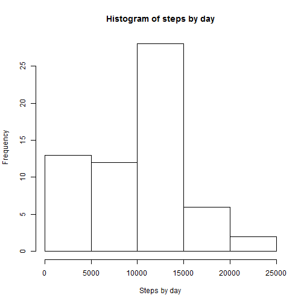
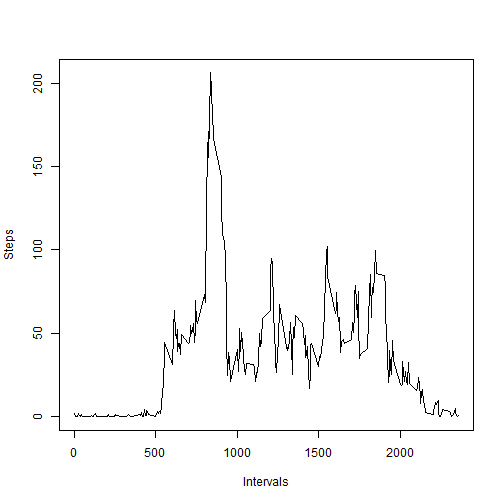
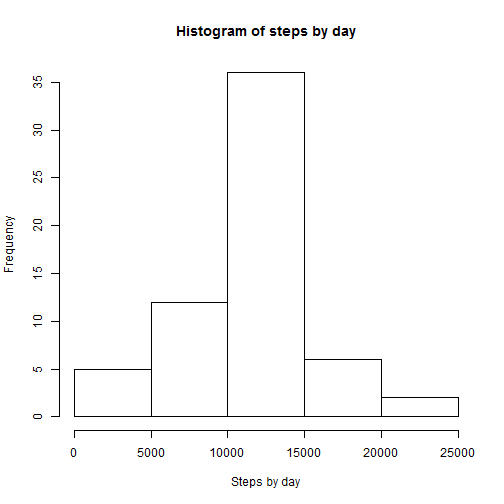
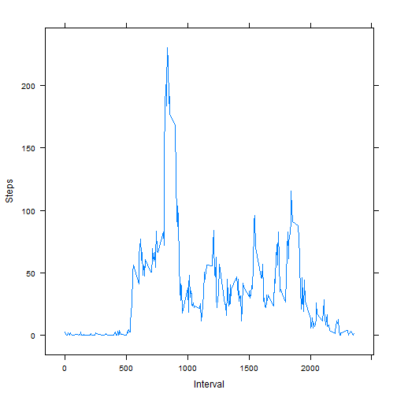
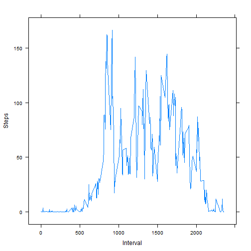

## Loading and preprocessing the data

Reads the data and saves it to a table called activity.


```r
setwd("C:/RepData_PeerAssessment1") 
unzip("activity.zip")  
activity<-read.csv("activity.csv", header=TRUE) 
```


## What is mean total number of steps taken per day?

First it's calculated the sum of steps by day and after it's ploted in a histogram


```r
stepsday<-rowsum(activity$steps,activity$date,na.rm = T)
hist(stepsday, xlab = "Steps by day",main = "Histogram of steps by day")
```

 

```r
meanst<-round(mean(stepsday))
medianst<-round(median(stepsday))
```

The mean of steps taken per day is 9354 and the median is 10395


## What is the average daily activity pattern?

This is a 5-minute interval time series plot vs the mean of steps for each interval


```r
stepsinterval<-tapply(activity$steps,activity$interval,mean, na.rm=TRUE)
plot(unique(activity$interval),stepsinterval,type = "l", xlab = "Intervals",
     ylab = "Steps")
```

 

This is the interval with the maximum number of steps


```r
stepsinterval[which.max(stepsinterval)]
```

```
##      835 
## 206.1698
```


## Imputing missing values

First it's calculated the number of NAs in the dataset


```r
sum(is.na(activity$steps))
```

```
## [1] 2304
```

Then each NA is replaced by the mean in the interval. 

So for example, if interval 0 on 2012-10-01 is NA then it is replaced by the mean of all the intervals 0, previously calculated


```r
stepsint<-stepsinterval
intervs<-unique(activity$interval)

setinterval<-data.frame(intervs,stepsint)
activity2<-activity

for (i in 1:length(activity2$steps))
{
    if(is.na(activity2$steps[i]))
    {interv<-activity2$interval[i]
    activity2$steps[i]=setinterval$stepsint[which(setinterval$intervs==interv)]
    activity2$steps=round(activity2$steps)
    }
}
```

Hence this histogram is generated


```r
stepsday2<-rowsum(activity2$steps,activity2$date)
hist(stepsday2, xlab = "Steps by day",main = "Histogram of steps by day")
```

 

```r
meanst2<-round(mean(stepsday))
medianst2<-round(median(stepsday))
```

The mean of steps taken per day with NAs replaced is 9354 and the median is 10395

## Are there differences in activity patterns between weekdays and weekends?

For clasification purposes, a weekdays column is created. Setlocale is used to set the days of the week in English.


```r
Sys.setlocale("LC_ALL","English")
```

```
## [1] "LC_COLLATE=English_United States.1252;LC_CTYPE=English_United States.1252;LC_MONETARY=English_United States.1252;LC_NUMERIC=C;LC_TIME=English_United States.1252"
```

```r
activity2$date<-as.POSIXct(activity2$date)
activity2$weekdays<-weekdays(activity2$date)
```

Then, using this column, another column is created to clasify as Weekday or Weekend


```r
days<-c("Monday","Tuesday","Wednesday","Thursday","Friday")
for (i in 1:length(activity2$weekdays))
{
  if(activity2$weekdays[i]%in%days)
  {
      activity2$state[i]<-"Weekday"
  }
    else
    {
        activity2$state[i]<-"Weekend"
    }
}
```

Using this, two new datasets are created. One for weekdays, one for weekend.


```r
weekdaysst<-activity2[which(activity2$state=="Weekday"),]
weekendst<-activity2[which(activity2$state=="Weekend"),]
```

And both of them are plotted.


```r
library(lattice)

stweekday<-tapply(weekdaysst$steps,weekdaysst$interval,mean)
xyplot(stweekday ~ unique(interval), data = activity2, type = "l",
       xlab = "Interval", ylab = "Steps")
```

 

```r
stweekend<-tapply(weekendst$steps,weekendst$interval,mean)
xyplot(stweekend ~ unique(interval), data = activity2, type = "l", 
      xlab = "Interval", ylab = "Steps")
```

 

As we can see there are differences in the weekends.Especially in the interval of 10:00 and 20:00.
